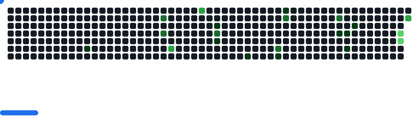

# Hi there! 👋 Welcome to my GitHub Profile

I'm a **Full-Stack Web Developer** passionate about crafting scalable and user-friendly web applications. With experience across both front-end and back-end technologies, I love solving problems and turning ideas into reality.

---

## 🔧 My Tech Toolbox

Here are the tools and technologies I work with:

### Frontend:
-  React.js
-  React Native
-  HTML
-  CSS
-  JavaScript (ES6+)

### Backend:
-  Node.js
-  Express.js
-  Java

### Databases:
-  MongoDB
-  SQL Server

---

## 🔗 Let's Connect

- 📧 Email: [trunghieu2003hhh@gmail.com](mailto:trunghieu2003hhh@gmail.com)
- 📚 LinkedIn: [linkedin.com/in/truqhieu](https://www.linkedin.com/in/truqhieu/)

---

<picture>
  <source
    media="(prefers-color-scheme: dark)"
    srcset="images/breakout-dark.svg"
  />
  <source
    media="(prefers-color-scheme: light)"
    srcset="images/breakout-light.svg"
  />
  
</picture>

## 🚀 Stats and Contributions

---

